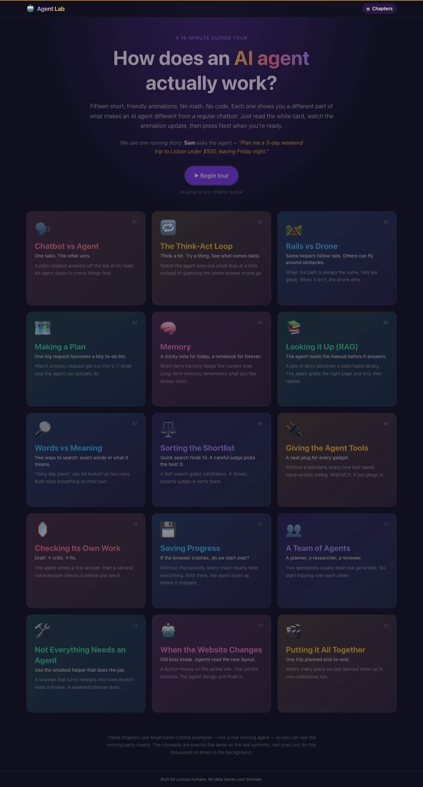
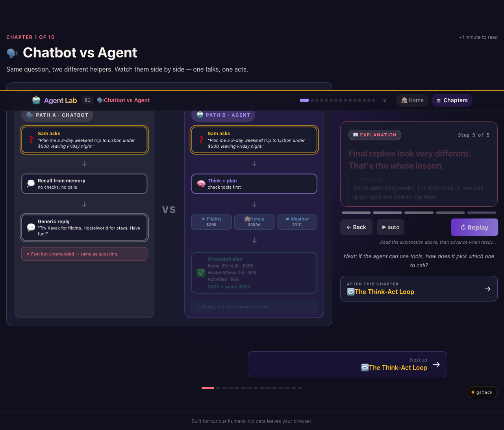
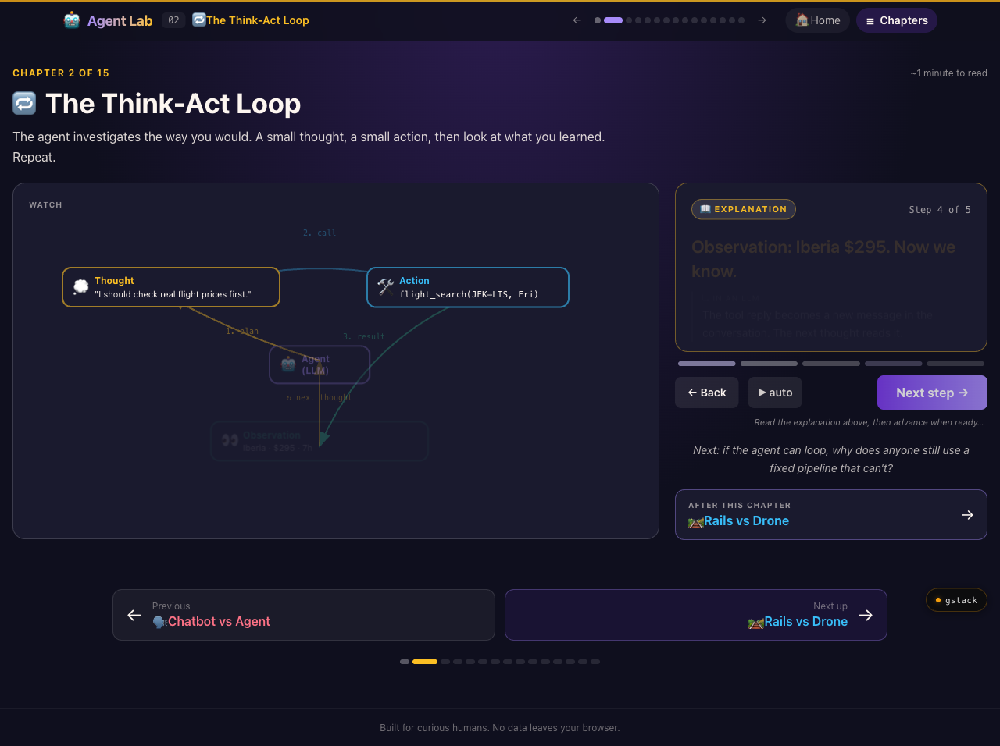
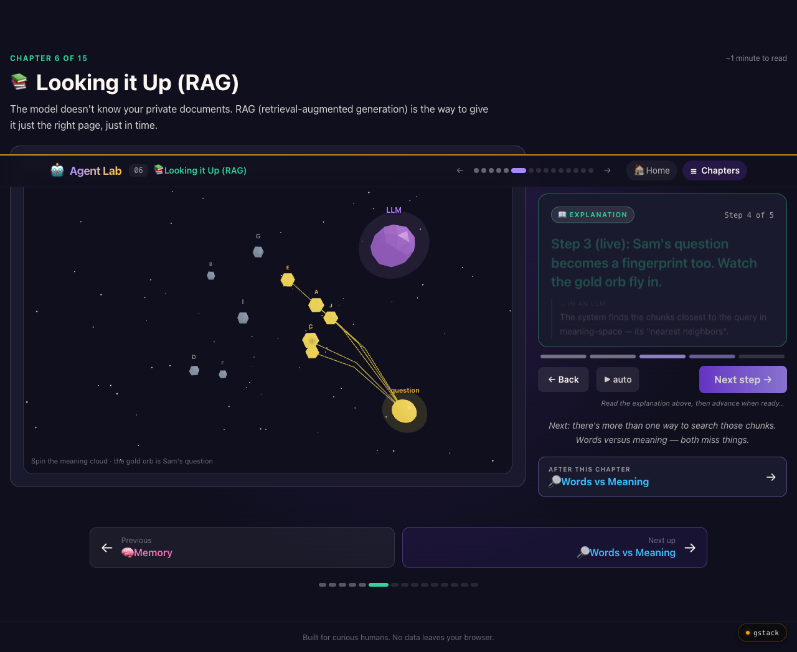
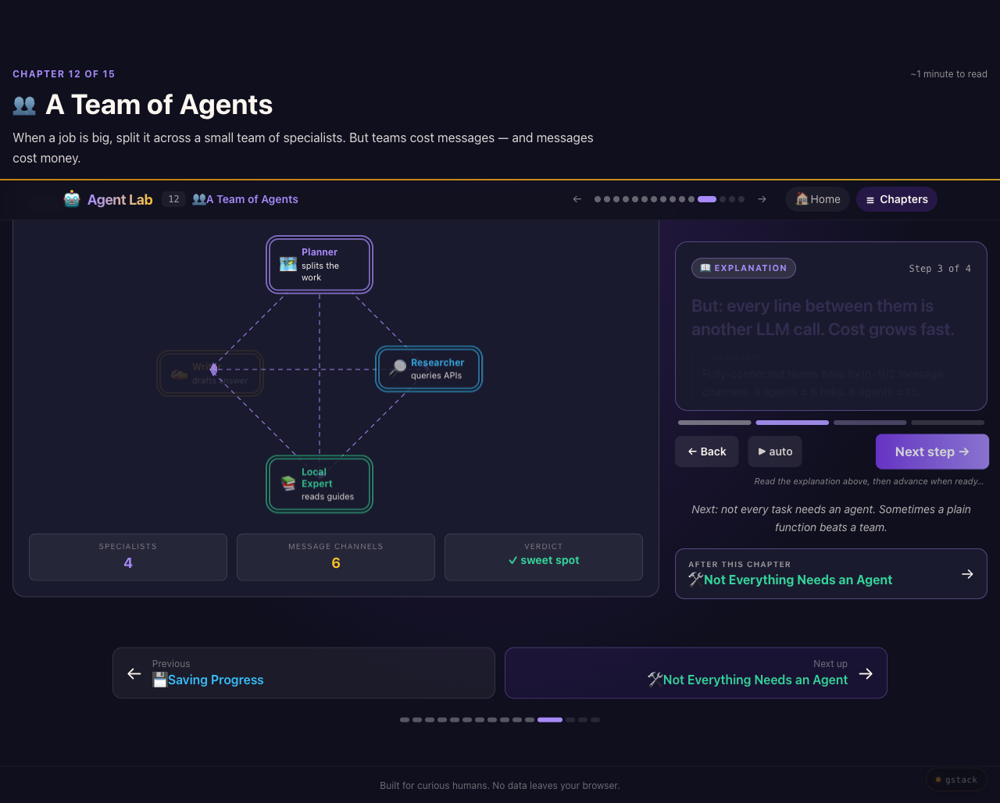

<div align="center">

# 🤖 Agent Explain Lab

### A 15-minute interactive tour of how AI agents actually work.

**No math. No code. No prior AI background needed.**

[**▶ Try it live →**](https://lionellau.github.io/agent-explain-lab)

<sub>Built by a tech mentor who got tired of explaining the same thing in every 1:1.</sub>



</div>

---

## Why this exists

I run regular mentoring sessions for engineers, students, and curious friends. After ChatGPT got tools, "agents" started showing up in almost every conversation:

> *"Wait — what's an agent? Isn't it just ChatGPT?"*

For months I answered it the same way — with whiteboard scribbles, the same four analogies, and a lot of arm-waving. The same drawings. The same metaphors. The same "imagine the model deciding what to do next" moment.

At some point it hit me: **if I'm explaining tools, memory, RAG, and multi-agent the same way every week, I should just turn the explanation into something everyone can play with.**

So I took the materials I use in mentoring sessions, distilled them into fifteen short visual chapters, and built this lab. If you've ever wanted a clear, no-math answer to *"what's an AI agent and how does it work?"* — or if you teach this and want something concrete to point people at — this is for you.

It's free, MIT-licensed, and runs entirely in your browser. Nothing leaves your machine.

This is a sister project to [**LLM Explain Lab**](https://github.com/lionellau/llm-explain-lab) (what's inside ChatGPT). Same design language, same calm pace.

---

## What you'll learn in 15 minutes

We follow one running story through every chapter — Sam asks the agent:

> *"Plan me a 3-day weekend trip to Lisbon under $500, leaving Friday night."*

…and you watch what each piece of an agent system does with that exact question.

| # | Chapter | The big idea you walk away with |
|---|---|---|
| 1 | 🗣️ **Chatbot vs Agent** | A chatbot answers from memory. An agent goes and checks real things first. |
| 2 | 🔁 **The Think-Act Loop** | The agent thinks → tries → looks → repeats. It doesn't answer in one shot. |
| 3 | 🛤️ **Rails vs Drone** | Workflows follow rails; agents fly around obstacles. Use each where it fits. |
| 4 | 🗺️ **Making a Plan** | One fuzzy request becomes a tidy checklist before any work starts. |
| 5 | 🧠 **Memory** | Sticky notes for today, a notebook for forever — and the filter matters most. |
| 6 | 📚 **Looking it Up (RAG)** | Documents become a searchable meaning-space. The agent grabs just the right page. |
| 7 | 🔎 **Words vs Meaning** | Two ways to search — keyword and semantic — and why production uses both. |
| 8 | ⚖️ **Sorting the Shortlist** | Fast search finds 10; a slower judge picks the best 3. |
| 9 | 🔌 **Giving the Agent Tools** | MCP is "USB for AI tools." Plus the failure modes you can't ignore. |
| 10 | 🪞 **Checking Its Own Work** | A second voice catches the draft that breaks the rules. |
| 11 | 💾 **Saving Progress** | If the browser crashes mid-plan, the agent picks up where it stopped. |
| 12 | 👥 **A Team of Agents** | Two specialists usually beat one generalist. Six start tripping over each other. |
| 13 | 🛠️ **Not Everything Needs an Agent** | Skill vs workflow vs agent vs multi-agent — pick the smallest helper that works. |
| 14 | 🤖 **When the Website Changes** | RPA breaks on a redesign. Agents read the new layout. |
| 15 | 🎬 **Putting it All Together** | Every piece, end-to-end. One trip, planned by the whole machine. |

Each chapter is one prominent "📖 Explanation" panel paired with a live animation. You read, you watch the visual update, then you press **Next** when ready. No quizzes. No friction. The Next button glows after a 3-second reading delay so you can take your time.

---

## A peek inside

<table>
<tr>
<td width="50%">

**Chatbot vs Agent — the same question, two answers**



</td>
<td width="50%">

**The Think-Act Loop — the agent's basic rhythm**



</td>
</tr>
<tr>
<td width="50%">

**RAG — meaning lives in 3D space (real Three.js)**



</td>
<td width="50%">

**A Team of Agents — specialists vs bureaucracy**



</td>
</tr>
</table>

---

## How it's built

Vanilla web stack — open it on any modern browser, no install:

- **Vite + React 19 + TypeScript** — the app shell
- **Tailwind CSS v4** — styling
- **Three.js + @react-three/fiber + @react-three/drei** — the 3D meaning-space in the RAG chapter
- **HashRouter** — so deep-links work on plain static hosting (GitHub Pages, Netlify, anything)

The visualizations are hand-crafted: there is no real agent running under the hood. Every animation uses small, deterministic examples so you can clearly see one moving part at a time. The concepts are real; the data is curated for clarity.

The other chapters use SVG arrows + HTML node boxes (the `Flow.tsx` helpers) rather than 3D. **3D is only where 3D is the lesson** — meaning-as-space in the RAG chapter. Everything else is cleaner as a 2D workflow.

Mobile users get a **sticky-bottom story panel** so the Next button is always thumb-reachable while the diagram stays visible above. Desktop uses a 1fr / 400px split with the explanation sticky to the right.

### Security & privacy

- **Zero backend.** No API keys, no inference servers, no analytics.
- **Strict Content-Security-Policy** applied via both `vite.config.ts` and `public/_headers` (Netlify / Cloudflare Pages compatible).
- **No remote network calls** from the running app — `connect-src 'self'`.
- See [SECURITY.md](SECURITY.md) for the full threat model.

---

## Run it locally

```bash
git clone https://github.com/lionellau/agent-explain-lab.git
cd agent-explain-lab
npm install
npm run dev
```

Open the printed URL (usually `http://localhost:5174`). Edit any file in `src/pages/` and the page hot-reloads.

To build the static bundle:

```bash
npm run build      # outputs to dist/
npm run preview    # serve the production build locally at http://127.0.0.1:4173
```

Prefer Bun? `bun install && bun dev` works too — Vite supports both.

---

## For fellow mentors and educators

If you teach AI/ML and want to use this in a workshop, class, or 1:1 — please do. You can:

- **Deep-link to any chapter:**
  [`#/chatbot-vs-agent`](https://lionellau.github.io/agent-explain-lab/#/chatbot-vs-agent),
  [`#/react-loop`](https://lionellau.github.io/agent-explain-lab/#/react-loop),
  [`#/rag`](https://lionellau.github.io/agent-explain-lab/#/rag),
  [`#/tools-mcp`](https://lionellau.github.io/agent-explain-lab/#/tools-mcp),
  [`#/multi-agent`](https://lionellau.github.io/agent-explain-lab/#/multi-agent),
  [`#/capstone`](https://lionellau.github.io/agent-explain-lab/#/capstone), …
- **Fork the repo** and rewrite the explanations in your own voice. Every chapter is its own ~100-line file in `src/pages/`. The beats — the bold one-sentence captions — are plain arrays at the top of each page; rewrite them and the rest of the chapter follows.
- **Swap the running story:** the Lisbon-trip scenario lives in `src/chapters.ts` (`STORY` constant). Replace it with your own use case (customer support, code review, research task — whatever your audience cares about) and every chapter updates.

If you do use it, I'd love to hear how it went. Open an issue or ping me.

---

## Roadmap (open to contributions)

- [ ] "Show the code" toggle that reveals the actual LangGraph / LangChain / vanilla-LLM equivalent of each chapter
- [ ] Localized narration (Chinese, Spanish, Japanese to start)
- [ ] Audio narration option for accessibility
- [ ] More failure modes for the Tool Calling chapter (rate-limits, partial JSON, hallucinated tool names)
- [ ] A "Training" chapter showing how an agent's tool-choice habits get tuned in the first place

PRs welcome. Issues with concrete teaching use-cases especially welcome.

---

## About the author

**Lionel Lau** — Senior engineer & tech mentor. I run regular mentoring sessions for engineers at different career stages, and this project came out of fielding the same handful of agent questions every week. If you've ever sat across from me at coffee and asked *"so what's the difference between an agent and just calling GPT in a loop?"* — this is the answer I wish I'd handed you instead of drawing on a napkin.

- GitHub: [@lionellau](https://github.com/lionellau)
- Sister project: [LLM Explain Lab](https://github.com/lionellau/llm-explain-lab) — the same treatment for what's *inside* the model itself

If this saved you an hour of explaining things to someone — that's exactly what I built it for.

---

## License

[MIT](LICENSE) — use it, fork it, ship it, teach with it. A link back is appreciated but not required.

## Credits

The pedagogical approach borrows from several outstanding explainers I studied while building this:

- [Anthropic — Building effective agents](https://www.anthropic.com/research/building-effective-agents)
- [LangChain — Agent concepts](https://python.langchain.com/docs/concepts/agents/)
- [Lilian Weng — LLM-powered Autonomous Agents](https://lilianweng.github.io/posts/2023-06-23-agent/)
- [Model Context Protocol](https://modelcontextprotocol.io/)

If you want to go deeper after this lab, those are the next stops.
